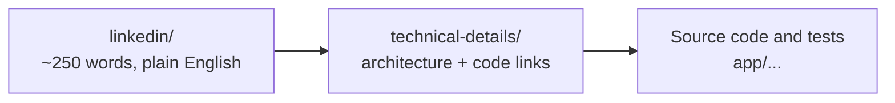

# Agent Sentinel — a 10-part series

**Positioning:** Agent Sentinel is an explainable runtime observability and
policy-detection layer for AI agents. It detects, explains, stores, and
exports evidence-rich findings into SOC platforms such as Microsoft Sentinel
and Splunk.

**Current product line:** Detect. Explain. Export.
**Roadmap:** Enforce, through a separately reviewed pre-action gateway. The
current engine produces post-observation findings; it does not block or
quarantine actions.

## Two audiences, two levels

Every part has a plain-English LinkedIn post for CISOs and business readers,
and a technical write-up (with an "In plain terms" summary up top) for
architects and engineers. The [traceability matrix](TRACEABILITY.md) ties each claim to its implementation,
its regression test, and its current-versus-roadmap boundary.

| # | Part | LinkedIn post | Technical write-up | Main code | Regression test |
|---|---|---|---|---|---|
| 1 | Why AI Agents Need a Flight Recorder | [post](linkedin/01-why-agents-need-a-flight-recorder.md) | [read](technical-details/01-why-agents-need-a-flight-recorder.md) | `pipeline.py`, `detection/engine.py` | [`test_pipeline.py`](../../app/tests/test_pipeline.py) |
| 2 | From Simulated Traffic to Real Model Calls | coming soon | coming soon | | |
| 3 | Rules First, Statistics Second | coming soon | coming soon | | |
| 4 | The Enterprise Foundation | coming soon | coming soon | | |
| 5 | Feeding the SOC, and What's Next | coming soon | coming soon | | |
| 6 | The Blind Spot Every AI-Agent Firewall Has | coming soon | coming soon | | |
| 7 | Visibility Without a Blank Check | coming soon | coming soon | | |
| 8 | From Open Port to Explainable Finding | coming soon | coming soon | | |
| 9 | Built to Fail Safe, Not Fail Quiet | coming soon | coming soon | | |
| 10 | What This Doesn't Do Yet | coming soon | coming soon | | |

Every link in this folder is relative, so the article, the code, and the tests
always resolve on the same repository version. Run `python scripts/check_links.py` to verify
every relative link and heading anchor.

## Single source of truth

This folder is the only place the series is written, and it lives in the same
repository as the website. [anandnarayanan.net](https://anandnarayanan.net/)
is built from it: each site post is the plain-English part of
`technical-details/NN-*.md` (everything above "Design and implementation"),
its image, and the date from the "On the site" column below
(`scripts/sync-series.mjs` at the repository root does this at build time).
Edit here, never in the generated site files. The LinkedIn posts in
`linkedin/` link back to the site.

## Publishing plan

A part is released when it lands in this folder: its post goes live on the
site, and its write-up, code and tests appear here. Rows marked "coming soon"
above are not released yet. LinkedIn posts go out one per week, on Tuesdays,
in numeric order: Parts 5 and 10 each close a series and refer back to the
parts before them. If a week is missed, shift the whole column.

| LinkedIn week of | Part | On the site | Goal |
|---|---|---|---|
| 2026-10-06 | 1. Why AI Agents Need a Flight Recorder | 2026-10-02 | Establish the problem |
| 2026-10-13 | 2. From Simulated Traffic to Real Model Calls | 2026-10-13 | Show the working MVP and the real-SDK pivot |
| 2026-10-20 | 3. Rules First, Statistics Second | 2026-10-20 | Build technical credibility, including the sequence-model pivot |
| 2026-10-27 | 4. The Enterprise Foundation | 2026-10-27 | Show what makes it serious for CISOs |
| 2026-11-03 | 5. Feeding the SOC, and What's Next | 2026-11-03 | Clarify positioning and roadmap; series 1 closes |
| 2026-11-10 | 6. The Blind Spot Every AI-Agent Firewall Has | 2026-11-10 | Reopen on a concrete new capability |
| 2026-11-17 | 7. Visibility Without a Blank Check | 2026-11-17 | Show the scoping discipline before the capability |
| 2026-11-24 | 8. From Open Port to Explainable Finding | 2026-11-24 | Technical credibility on the network collector |
| 2026-12-01 | 9. Built to Fail Safe, Not Fail Quiet | 2026-12-01 | The most shareable post: a real bug caught before shipping |
| 2026-12-08 | 10. What This Doesn't Do Yet | 2026-12-08 | Close on honesty and the roadmap |
