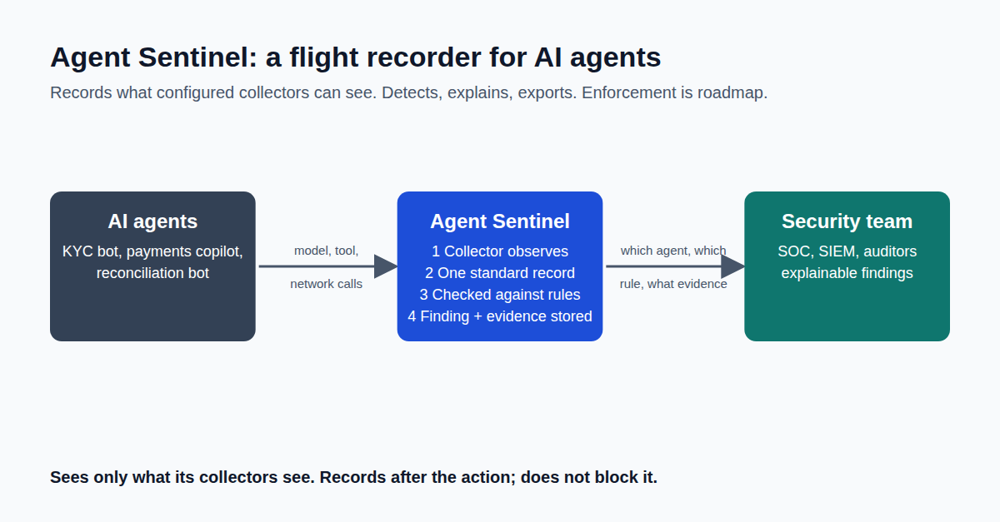

Your payments agent just sent 250KB to a server nobody approved.

Could you prove what happened?

Most firms running AI agents have logs. Few have evidence. A log says "a request happened." An auditor wants to know which agent did it, what it was allowed to do, and why it mattered.

In a regulated firm, "we think it was fine" is not an answer.

So I made one decision before anything else: record first, block later.

Agent Sentinel works like a flight recorder. It doesn't fly the plane. It makes sure that whatever an agent does, there is a clear, readable record of it, checked against agreed rules.

Blocking comes later, on the roadmap. You can't safely block what you can't yet explain.

This is Part 1 of a 10-part series on building it.
Next week: Part 2, From Simulated Traffic to Real Model Calls.

If an auditor asked today what your AI agents did last week, what could you show them?

First comment: Read the full article → https://anandnarayanan.net/blog/agent-sentinel-01-why-agents-need-a-flight-recorder/
Code and tests: https://github.com/anandnarayanan2017/anandnarayanan-blog/tree/main/agent-sentinel

#AIAgents #AIGovernance #CISO #AuditReadiness
