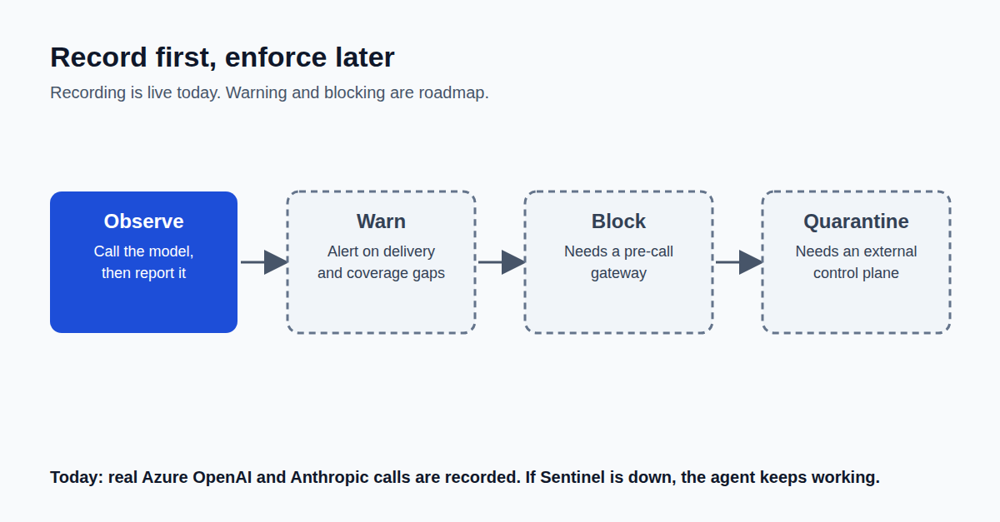

Most security tools start with blocking. I started with recording.

Why? Because a monitor that can take down your payment process the first time it hiccups is worse than no monitor at all.

So Agent Sentinel was built in two steps. First, prove the recording and the rule checks on simulated fintech traffic, where nothing real is at risk. Only then point it at real AI model calls.

And one rule I didn't compromise on: if the recorder is ever unreachable, the agent's work still goes through. The gap is logged, visible, and fixable. The payment still settles.

Recording is allowed to fail open. Blocking, when it comes, won't be.

For a regulated firm, that ordering is what makes a new control something operations will accept rather than quietly work around.

This is Part 2 of a 10-part series on building it.
Next week: Part 3, Rules First, Statistics Second.

Where would you draw the line between complete recording and never getting in the way?

First comment: Read the full article → https://anandnarayanan.net/blog/agent-sentinel-02-simulation-to-real-models/
Code and tests: https://github.com/anandnarayanan2017/anandnarayanan-blog/tree/main/agent-sentinel

#AIAgents #FinTech #AIGovernance #Observability
