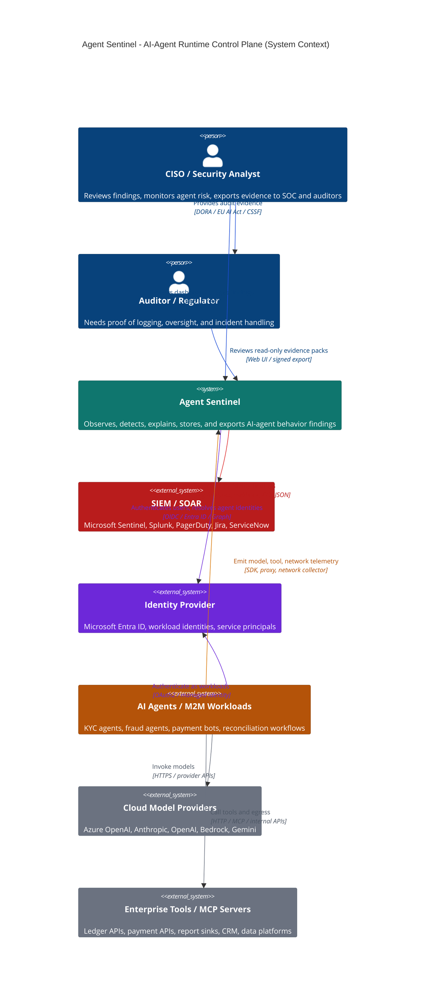

# Part 1 — Why AI Agents Need a Flight Recorder

> **Reader path:** [LinkedIn post](../linkedin/01-why-agents-need-a-flight-recorder.md) → this design → [code-and-test traceability](../TRACEABILITY.md#publication-traceability)

## What is Agent Sentinel?

AI agents are starting to do real work in banks and fintechs: reconciling
payments, checking customer identities, drafting regulatory reports. They
call AI models, use internal tools and send data over the network, often
without a person watching each step.

**Agent Sentinel is a flight recorder for those agents.** It records what
each agent did, checks it against rules you wrote, and turns anything
outside those rules into a plain-language finding your security team and
auditors can read.

It doesn't fly the plane. It makes sure that, whatever happens, there is
trustworthy evidence of it.

## The use case

A payments-reconciliation agent runs every night. Its job is to read the
ledger, ask an approved AI model to summarise discrepancies, and email a
report to finance. Nothing else.

One night it does something different:

1. It reads the ledger. *Allowed.*
2. It asks the approved model for a summary. *Allowed.*
3. It sends a 250KB file to a server that isn't on its approved list.
   *Not allowed.*

Agent Sentinel records all three steps as one timeline for that agent, and
raises a finding for step 3: which agent, where the data went, which rule it
broke, when, and which regulatory control that relates to. The finding can
be exported to the security team's existing SIEM.

Today it records and flags the transfer after it happens. Stopping it before
it happens is on the roadmap.

## The business problem it solves

Ask most firms what their AI agents did last month, and whether they can
prove it was safe, and the honest answer is "not really":

- **Logs aren't evidence.** A log says "a request happened." It doesn't say
  which agent made it, whether it was allowed, or why it matters.
- **The trail is scattered.** Model calls, tool use and network traffic sit
  in different systems, owned by different teams.
- **Auditors need readable answers.** "The model scored it 0.87" can't be
  checked or challenged. "It broke rule X, here is the evidence" can.
- **Regulators are asking.** In a regulated firm, "we think it was fine" is
  not an answer to a question about an automated system.

That isn't a technical gap. It's a business risk, in the same category as
not knowing who has access to your production database.

**In one line:** Agent Sentinel turns what your AI agents did into evidence
you can show an auditor.

**What it doesn't do (yet):** it only sees what its collectors are set up to
see, and it records and flags rather than blocks.

## What's in this series

Ten short parts, each one design decision and why it was made:

1. **Why AI agents need a flight recorder**: this part.
2. Record first, block later: from simulated traffic to real model calls, and why recording must never break the agent.
3. Rules decide, statistics advise: why a readable rulebook comes before any AI model.
4. What makes it enterprise-ready: identity, audit trail and human approvals.
5. Feeding the SOC: evidence for your existing SIEM, not another dashboard.
6. The blind spot: traffic that bypasses the proxy.
7. Visibility without a blank check: watching only the machines you name.
8. From open port to finding: turning a scan result into evidence.
9. The bug that never shipped: a false-alarm flood caught in design review.
10. What it doesn't do yet: the honest limits.

## Design and implementation

For actions visible through configured collectors, Agent Sentinel records the
agent, model call, network destination, and either an executed MCP call or a
model-proposed tool request. It then produces evidence-backed findings. It
does not claim to observe uninstrumented actions or block them before they run.

### C4 Level 1 — System Context



### Implementation details

The core loop is deliberately small:

```text
collector -> parser -> AgentEvent -> detection engine -> Finding -> storage -> dashboard/SIEM
```

| Repo Area | What It Implements |
|---|---|
| [`app/sentinel/schema/events.py`](../../../app/sentinel/schema/events.py) | Normalized `AgentEvent`, `Finding`, `Evidence`, severity, and action types |
| [`app/sentinel/collector/parsers.py`](../../../app/sentinel/collector/parsers.py) | Classifies visible traffic as `LLM_CALL`, `TOOL_REQUESTED`, `TOOL_CALL`, `NETWORK_CALL`, or `DATA_ACCESS` |
| [`app/sentinel/detection/engine.py`](../../../app/sentinel/detection/engine.py) | Deterministic policy checks plus baseline anomaly checks |
| [`app/sentinel/explain/explainer.py`](../../../app/sentinel/explain/explainer.py) | Human-readable finding explanations with policy clauses and control refs |
| [`app/sentinel/storage/store.py`](../../../app/sentinel/storage/store.py) | DuckDB local storage for POC and local pilots |
| [`app/sentinel/storage/pg_store.py`](../../../app/sentinel/storage/pg_store.py) | PostgreSQL / TimescaleDB storage for enterprise-grade persistence |
| [`app/sentinel/api/main.py`](../../../app/sentinel/api/main.py) | REST API, SSE stream, approvals, audit log, dashboard serving |
| [`dashboard/index.html`](../../../dashboard/index.html) | CISO dashboard with live findings, evidence drawer, approvals, events feed |

### Where the AI actually is

The question a reader of an AI-security product asks first, answered with
counted numbers rather than positioning.

**Agent Sentinel performs no LLM inference anywhere in its own runtime.** It
wraps the Anthropic and Azure OpenAI SDKs, but only to observe the calls an
*agent* makes — Sentinel never asks a model anything itself. One optional seam
exists, `Explainer(narrator=...)`, where a model could rewrite an explanation's
prose. It defaults to `None` and nothing in the product sets it.

Non-blank lines of product code, tests excluded:

| Layer | Lines | Share | What it is |
|---|---:|---:|---|
| Platform (API, storage, auth, collectors, export) | 4,069 | 61% | Plumbing |
| Sequence model (`app/sentinel_sequence/` + adapter) | 1,792 | 27% | The only machine learning |
| Deterministic detection, schema, explainability | 667 | 10% | `if` statements and string templates |
| Descriptive statistics (`detection/baseline.py`) | 115 | 2% | Means, standard deviations, set membership |

Roughly **70% of this product contains no AI or ML at all**, and the part that
does is one Markov chain — first or second order over a ~28-token action
vocabulary, trained by counting transitions, Laplace-smoothed so novel
behaviour scores as *surprising* rather than *impossible*, and persisted as a
JSON file of integers. `numpy` appears in four files, computing medians and
array arithmetic, never a learned parameter. There is no `sklearn`, no
`torch`, and no gradient anywhere in the repository.

That model also ships switched off (`SeqLayerConfig.enabled = False`), cannot
cite a policy clause — `Explainer.build_sequence()` hardcodes
`policy_clause=None`, so it is structurally incapable of denying anything —
and fails open at both construction and evaluation.

#### Why the boring answer is the design

A payments bot gets frozen mid-run and the compliance officer asks why. Two
possible answers:

> **A.** "The model scored this session at 0.87 anomalous, above our 0.85 threshold."
>
> **B.** "It called `initiate_wire_transfer`. Its policy permits `check_balance`,
> `get_exchange_rate`, `initiate_sepa_transfer`, `initiate_swift_transfer` and
> `confirm_payment`. Clause `allowed_tools`, agent `payment-processor`, session
> `s-4417`, 09:42:03 UTC."

Answer A cannot be argued with, which reads as strength until you are the one
defending it to a regulator — or overturning it at 2am because it was wrong.
Answer B can be checked, challenged, and changed by a human in a pull request.

The layer ordering makes that structural rather than cultural (ADR-0001): the
deterministic layer runs first and is the only layer permitted to deny. The ML
earns its place in the one spot rules cannot reach — **order**. An allow-list
can confirm `verify_id`, `check_sanctions` and `initiate_wire_transfer` are
each permitted. It cannot notice the transfer happened *before* the sanctions
check.

One caveat, stated because the repo states it: every published figure for that
model comes from synthetic data the author wrote — both the normal workflows
and the attacks. `docs/EVAL_PAYMENTS_BOT.md` calls this the "author-designed
validity ceiling" and declines to present the numbers as real-world
performance.

Next: Part 2 — From Simulated Traffic to Real Model Calls.
